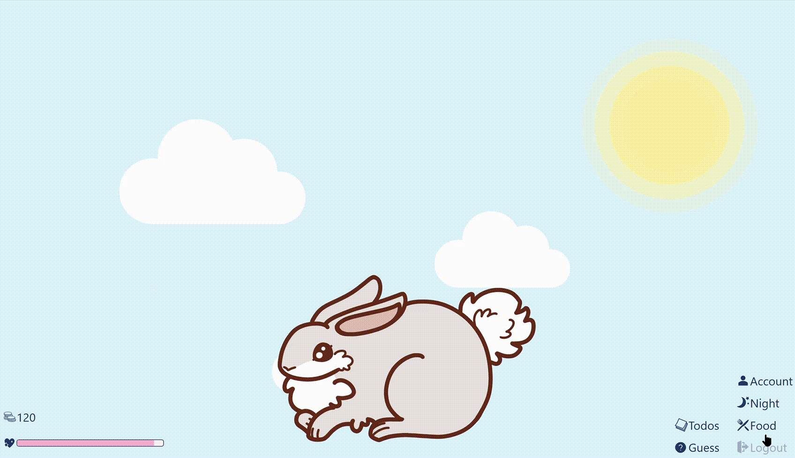
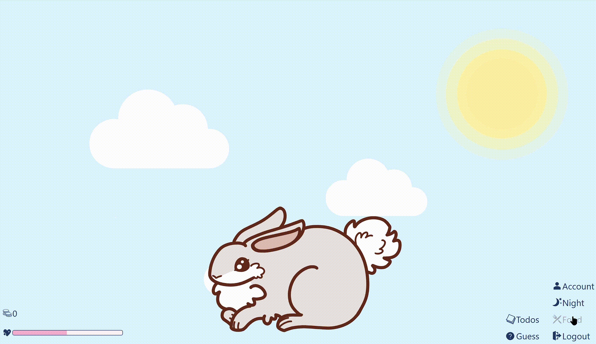
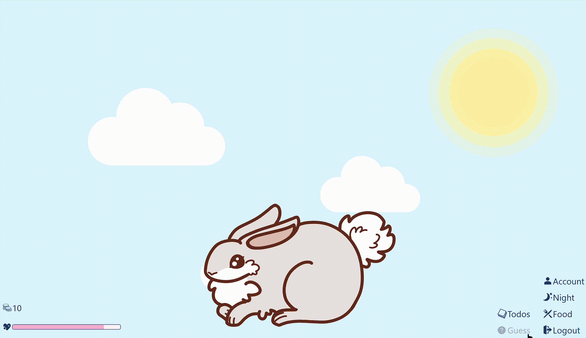
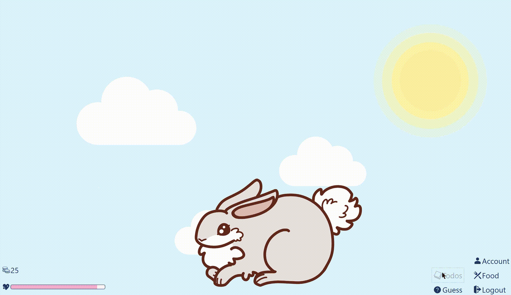
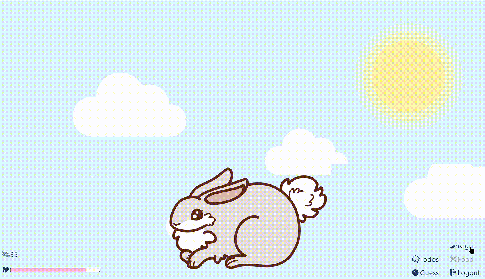

# Features

- Table of Contents
  - [Account](#account)
  - [Happiness Level](#happiness-level)
  - [General Pet Interactions](#general-pet-interactions)
  - [To-do List](#to-do-list)
  - [Shop](#shop) (_coming soon_)
  - [Day and Night Mode](#day-and-night-mode)

## Account

- Player is able to create an account with a unique username and password to store the current pet’s data
  
- Keeps track of the player’s statistics
  - Total Happiness level gained overall
    - Once a pet has reached maximum happiness level, a breakdown of events that increased happiness level is shown (_coming soon_)
  - Amount of todos and sub todos completed
  - Best time of completion for the “Rescue” minigame (_coming soon_)
    
- Achievements (e.g. for number of pets, unlocking a new pet type) (_coming soon_)

The account keeps track of the player’s statistics and achievements, a visualisation of the player’s productivity which can inspire the player to continue completing todos and thus, be productive.

## Happiness Level

- Happiness level decreases over time
- If happiness level is 0, the in-game currency will decrease to 0
- If happiness level is maximum, the pet transits to maximum happiness state and in-game currency increases
  
  - When maximum happiness level is reached, a random pet from locked pet types is unlocked (_coming soon_)
- Pet Interactivity (_coming soon_)

  | Happiness Level | Pet State         |
  | --------------- | ----------------- |
  | Zero            | brokenhearted     |
  | Low             | sad               |
  | Normal          | general           |
  | High            | happy             |
  | Maximum         | maximum happiness |

Since the happiness level of the pet is constantly decreasing, the player needs to continuously interact with it or complete todos (which gives more happiness points). This fulfills the app’s aim to be a virtual pet, and to increase productivity. The pet’s appearance will also change with its happiness level, mimicking an actual pet.

## General Pet Interactions

- Petting
  - Pet is normally in a “general” state
  - Pet will do an action(e.g. jump/rollover) and transit into a “reaction” state when the user double clicks
    
- Feeding
  - General food options are displayed (e.g. Cookie, Burger, Chocolate, Donut, Pizza, Watermelon)
  - Player can drag their choice of food to the pet, pet transits into a “eating” state
  - Happiness level of pet will increase after feeding
    
- Playing
  - “Guess” minigame (only available once per day)
  - Pet transits into a “questioning” state
  - Two buttons will pop up and the player picks one
  - If the player guessed correctly → either happiness level of pet increases or player gets some coins
  - If the player guessed wrongly → happiness level of pet decreases
    
- “Rescue” minigame (_coming soon_)
  - Pet is trapped in a box, pet transits into a panic state
  - Getting pet out of box → aggressive clicking
  - Time limit → if you don’t rescue your pet on time: happiness level of pet decreases
  - Success → increases the pet’s happiness level

These personal pet interactions allow for the player to have a stronger connection with the virtual pet, emulating a real pet. This bond can then serve as a strong motivator for the player to be productive to keep their pets happy.

## To-do List

- Create todos and sub todos with descriptions, difficulty levels and deadlines

  - Select a date using a datepicker
  - Edit description by clicking on the description
  - Colour of date of the todo changes colour as the deadline is reaching

    | Colour     | Days to Deadline |
    | ---------- | ---------------- |
    | Light Pink | more than 3 days |
    | Pink       | 0 to 3 days      |
    | Dark Pink  | less than 0 days |

- Difficulty levels range from 1 to 5, and the default difficulty level is 2

  |     | Difficulty Level |
  | --- | ---------------- |
  | 1   | Effortless       |
  | 2   | Simple           |
  | 3   | Medium           |
  | 4   | Troublesome      |
  | 5   | Difficult        |

  

- Able to rearrange todos and sub todos by dragging them around
  - User can rearrange todos
  - User can rearrange sub todos within the todo
  - User can move a sub todo to another todo
    
- Todo can be marked as completed or deleted

  - Todo is removed after completion or deletion
  - Complete a todo → pet transits into a “productive” state, happiness level and in-game currency increases depending on the difficulty level of todo
    

This is the main productivity feature of our app, which the player can use to organise their life and monitor their own productivity. The satisfaction of crossing out a completed todo compounded with the happiness and currency reward will help to further motivate the player to be productive.

## Shop

(_coming soon_)

- In-game currency can be used to purchase items from the shop
- Purchase premium food from the fridge
  - Favourite food → gets happier compared to other foods
- Ability to purchase a new pet type
  - Stores the current pet information and replaces the current pet
  - Previously unlocked pet types will be free to use
- When maximum happiness level is reached, a random pet from locked pet types is unlocked

This feature appeals to the player’s desire to collect all the cute pets in the game, which will motivate the player to complete more todos to earn in-game currency. Furthermore, in order to unlock a new pet type, the player has to first reach maximum happiness with their current pet. This ensures that the player will properly take care of their virtual pet and be productive.

## Day and Night Mode

- Lights on and off → control player’s screen time
- Pet transits into a “sleeping” state during Night mode and certain features are unaccessible
  - To-do list is still available for use, happiness level will not increase after a task is completed, only coins will increase
- Happiness level will remain the same during Night mode
  

When life gets too hectic, taking care of the pet may overwhelm the player. Therefore, this feature allows the player to take a break before coming back to their pet. The to-do list feature will still be available during Night mode, so the player’s productivity will not be compromised.
