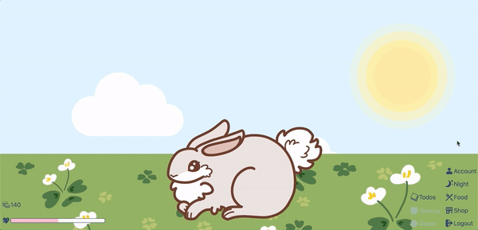
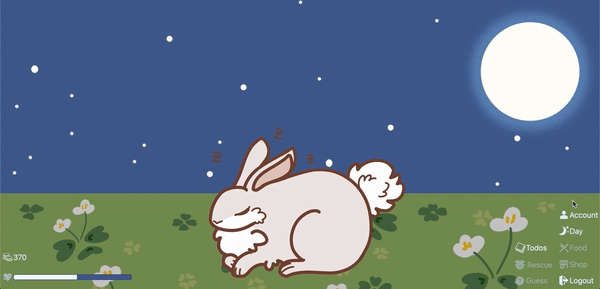
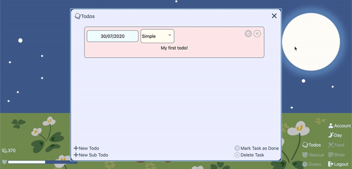
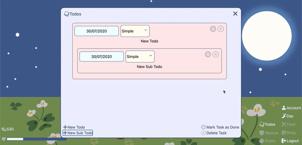
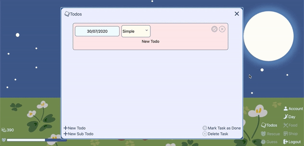
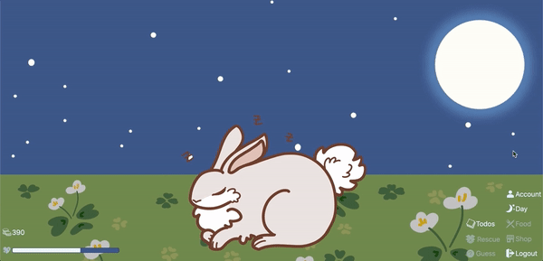

# Day and Night Mode

- Table of Contents
  - [Unit Testing](#unit-testing)
  - [Integrated Testing](#integrated-testing)

## Unit Testing

| Test Case         | Expected Result                                                      | Actual Result             | Fixes (if any) | Current Result |
| ----------------- | -------------------------------------------------------------------- | ------------------------- | -------------- | -------------- |
| Enable Night mode | Button's colour changes and button's label changes from Night to Day | _same_ as Expected Result | -              | -              |

## Integrated Testing

|    | **Test Case**                           | **Expected Result**                                                                                                                                               | **Actual Result**         | **Remarks** |
|----|-----------------------------------------|-------------------------------------------------------------------------------------------------------------------------------------------------------------------|---------------------------|-------------|
| 1  | enable Night mode                       | Background changes to night, features are greyed out except for Account, Todos, Day, Logout  | _same_ as Expected Result |             |
| 2  | click on Account during Night mode      | Account modal appears                                                                        | _same_ as Expected Result |             |
| 3  | click on Food during Night mode         | Nothing happens                                                                              | _same_ as Expected Result |             |
| 4  | click on Todos during Night mode        | Todo modal appears                                                                           | _same_ as Expected Result |             |
| 5  | complete a task during Night mode       | Coins increase, but no change in pet's state or happiness level                              | _same_ as Expected Result |             |
| 6  | complete a subtask during Night mode    | Coins increase, but no change in pet's state or happiness level                              | _same_ as Expected Result |             |
| 7  | delete a task/subtask during Night mode | Nothing happens                                                                              | _same_ as Expected Result |             |
| 8  | click on Guess during Night mode        | Nothing happens                                                                              | _same_ as Expected Result |             |
| 9  | click on Rescue during Night mode       | Nothing happens                                                                              |                           |             |
| 10 | click on Logout during Night mode       | Logged out and sent back to Login page                                                    | _same_ as Expected Result |             |
