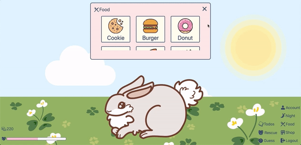
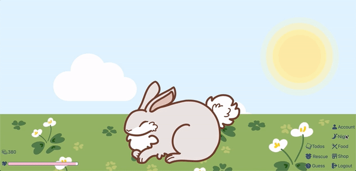
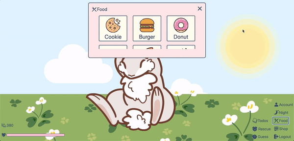
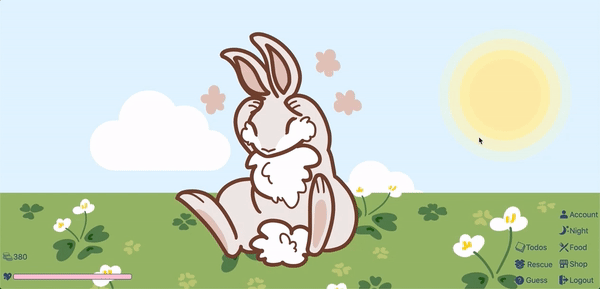
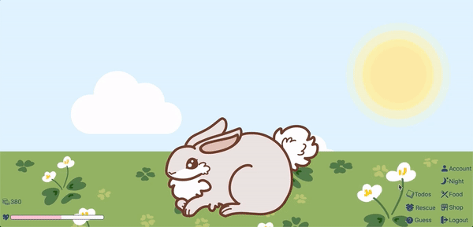
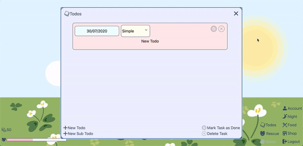
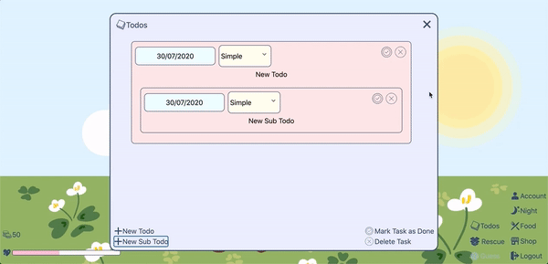
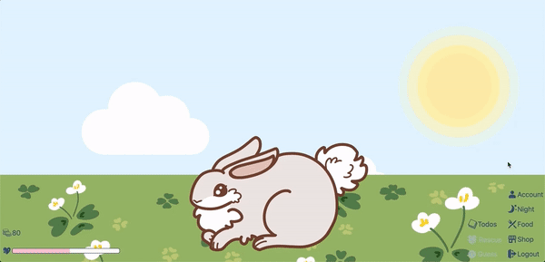
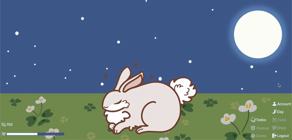

# General Pet Interactions

- Table of Contents
  - [Automated Testing](#automated-testing)
  - [Unit Testing](#unit-testing)
  - [Integrated Testing](#integrated-testing)

## Automated Testing

- Backend (with Postman)

<table>
<thead>
<tr>
<th></th>
<th>
Test Case
</th>
<th>
Request Body
</th>
<th>
Expected Result
</th>
<th>
Actual Result
</th>
<th>
Remarks
</th>
</tr>
</thead>

<tr>
<td>
1
</td>
<td>
PUT - http://localhost:5000/api/users/userdata
</td>
<td>

```json
{
  "name": "name",
  "dateGuessed": "2020-06-24T05:34:37.850Z"
}
```

</td>
<td>

```json
{
  "date": "2020-07-25T04:19:44.112Z",
  "coins": 0,
  "petId": 0,
  "totalHappinessGained": 0,
  "happinessGained": 0,
  "tasks": 0,
  "subTasks": 0,
  "dateGuessed": "2020-06-24T05:34:37.850Z",
  "dateRescued": "1970-01-01T00:00:00.000Z",
  "bestTimeRescued": 10,
  "_id": "5f1bb371725fcc3948867bc0",
  "name": "name",
  "password": "$2a$10$hvT9gftR5cDWa0rXf/p/7OQp6kV89Ywaz5JXXdtLvOonTdE/TyCM2",
  "__v": 0
}
```

</td>
<td>
<i>same</i> as Expected Result
</td>
<td></td>
</tr>

<tr>
<td>
2
</td>
<td>
PUT - http://localhost:5000/api/users/userdata
</td>
<td>

```json
{
  "name": ""
}
```

</td>
<td>

```json
{
  "name": "Name is required"
}
```

</td>
<td>
<i>same</i> as Expected Result
</td>
<td></td>
</tr>

<tr>
<td>
3
</td>
<td>
PUT - http://localhost:5000/api/users/userdata
</td>
<td>

```json
{
  "name": "name",
  "dateGuessed": "2020-43-24T05:34:37.850Z"
}
```

</td>
<td>

```json
{
  "dateGuessed": "dateGuessed is invalid"
}
```

</td>
<td>
<i>same</i> as Expected Result
</td>
<td></td>
</tr>

<tr>
<td>
4
</td>
<td>
PUT - http://localhost:5000/api/users/userdata
</td>
<td>

```json
{
  "name": "namefsrfdzf",
  "dateGuessed": "2020-06-24T05:34:37.850Z"
}
```

</td>
<td>

```json
{
  "message": "Cannot update data of user with username namefsrfdzf. Maybe User was not found!"
}
```

</td>
<td>
<i>same</i> as Expected Result
</td>
<td></td>
</tr>

<tr>
<td>
5
</td>
<td>
PUT - http://localhost:5000/api/users/userdata
</td>
<td>

```json
{
  "name": "name",
  "dateRescued": "2020-07-25"
}
```

</td>
<td>

```json
{
  "date": "2020-07-25T04:19:44.112Z",
  "coins": 0,
  "petId": 0,
  "totalHappinessGained": 0,
  "happinessGained": 0,
  "tasks": 0,
  "subTasks": 0,
  "dateGuessed": "2020-06-24T05:34:37.850Z",
  "dateRescued": "2020-07-25T00:00:00.000Z",
  "bestTimeRescued": 10,
  "_id": "5f1bb371725fcc3948867bc0",
  "name": "name",
  "password": "$2a$10$hvT9gftR5cDWa0rXf/p/7OQp6kV89Ywaz5JXXdtLvOonTdE/TyCM2",
  "__v": 0
}
```

</td>
<td>
<i>same</i> as Expected Result
</td>
<td></td>
</tr>

<tr>
<td>
6
</td>
<td>
PUT - http://localhost:5000/api/users/userdata
</td>
<td>

```json
{
  "name": "name",
  "dateRescued": "2020-43-24T05:34:37.850Z"
}
```

</td>
<td>

```json
{
  "dateRescued": "dateRescued is invalid"
}
```

</td>
<td>
<i>same</i> as Expected Result
</td>
<td></td>
</tr>

<tr>
<td>
7
</td>
<td>
PUT - http://localhost:5000/api/users/userdata
</td>
<td>

```json
{
  "name": "namefsrfdzf",
  "dateRescued": "2020-06-24T05:34:37.850Z"
}
```

</td>
<td>

```json
{
  "message": "Cannot update data of user with username namefsrfdzf. Maybe User was not found!"
}
```

</td>
<td>
<i>same</i> as Expected Result
</td>
<td></td>
</tr>

<tr>
<td>
8
<td>
PUT - http://localhost:5000/api/users/userdata
</td>
<td>

```json
{
  "name": "name",
  "bestTimeRescued": 5.4
}
```

</td>
<td>

```json
{
  "date": "2020-07-25T04:19:44.112Z",
  "coins": 0,
  "petId": 0,
  "totalHappinessGained": 0,
  "happinessGained": 0,
  "tasks": 0,
  "subTasks": 0,
  "dateGuessed": "2020-06-24T05:34:37.850Z",
  "dateRescued": "2020-07-25T00:00:00.000Z",
  "bestTimeRescued": 5.4,
  "_id": "5f1bb371725fcc3948867bc0",
  "name": "name",
  "password": "$2a$10$hvT9gftR5cDWa0rXf/p/7OQp6kV89Ywaz5JXXdtLvOonTdE/TyCM2",
  "__v": 0
}
```

</td>
<td>
<i>same</i> as Expected Result
</td>
<td></td>
</tr>

<tr>
<td>
9
</td>
<td>
PUT - http://localhost:5000/api/users/userdata
</td>
<td>

```json
{
  "name": "name",
  "bestTimeRescued": -3.4
}
```

</td>
<td>

```json
{
  "dateGuessed": "bestTimeRescued is invalid"
}
```

</td>
<td>
<i>same</i> as Expected Result
</td>
<td></td>
</tr>

<tr>
<td>
10
</td>
<td>
PUT - http://localhost:5000/api/users/userdata
</td>
<td>

```json
{
  "name": "name",
  "bestTimeRescued": 11
}
```

</td>
<td>

```json
{
  "dateGuessed": "bestTimeRescued is invalid"
}
```

</td>
<td>
<i>same</i> as Expected Result
</td>
<td></td>
</tr>

<tr>
<td>
11
</td>
<td>
PUT - http://localhost:5000/api/users/userdata
</td>
<td>

```json
{
  "name": "namefsrfdzf",
  "bestTimeRescued": 9.4
}
```

</td>
<td>

```json
{
  "message": "Cannot update data of user with username namefsrfdzf. Maybe User was not found!"
}
```

</td>
<td>
<i>same</i> as Expected Result
</td>
<td></td>
</tr>
</table>

## Unit Testing

|    | Test Case                                                                                                                                     | Expected Result                                                                                        | Actual Result           | Remarks                                                                                                                                                                     |
|----|-----------------------------------------------------------------------------------------------------------------------------------------------|--------------------------------------------------------------------------------------------------------|-------------------------|-----------------------------------------------------------------------------------------------------------------------------------------------------------------------------|
| 1  | Click on pet                                                                                                                                  | Pet's state changes to reaction state for a few seconds before changing back                           | same as Expected Result |                                                                                                                                                                             |
| 2  | Click on Food                                                                                                                                 | Food modal appears                                                                                     | same as Expected Result |                                                                                                                                                                             |
| 3  | Drag food icons out of Food modal                                                                                                             | Food icons can be dragged out                                                                          | same as Expected Result | Actual Result(before fix) : Food modal closes<br>Fix: Changed from react-modal to plain javascript                                                                          |
| 4  | Click exit button of Food modal                                                                                                               | Food modal closes                                                                                      | same as Expected Result |                                                                                                                                                                             |
| 5  | Click anywhere outside of Food modal                                                                                                          | Food modal remains open                                                                                | same as Expected Result |                                                                                                                                                                             |
| 6  | Click on Guess                                                                                                                                | Guess modal appears                                                                                    | same as Expected Result |                                                                                                                                                                             |
| 7  | Click exit button of Guess modal                                                                                                              | Guess modal closes                                                                                     | same as Expected Result |                                                                                                                                                                             |
| 8  | Click anywhere outside of Guess modal                                                                                                         | Guess modal closes                                                                                     | same as Expected Result |                                                                                                                                                                             |
| 9  | Pick a gift in Guess                                                                                                                          | Guess modal changes to only display a message revealing what rewards the player obtained               | same as Expected Result |                                                                                                                                                                             |
| 10 | Repeatedly pick the same gift option                                                                                                          | Rewards are randomised, may lose happiness, gain happiness or coins                                    | same as Expected Result |                                                                                                                                                                             |
| 11 | Close Guess modal after choosing                                                                                                              | Guess button greys out and Guess modal does not appear when clicked                                    | same as Expected Result | Actual Result (before fix): Guess modal appears<br>Fix: Added dateGuessed to user Schema to keep track of when user last played and checked availability in Guess component |
| 12 | Close Guess modal without choosing                                                                                                            | Guess button does not change colour and Guess modal appears when clicked                               | same as Expected Result |                                                                                                                                                                             |
| 13 | For testing purposes, the minigame can be played once every minute rather than everyday.<br>Wait for a minute for Guess minigame to be reset  | Guess button gains colour and can be clicked                                                           | same as Expected Result | Actual Result (before fix): Guess button only changes colour after being clicked<br>Fix: Used setTimeout in Guess component to set state after 1 minute                     |
| 14 | Click on Rescue                                                                                                                               | Rescue page loads                                                                                      | same as Expected Result |                                                                                                                                                                             |
| 15 | Click Home button in Rescue page without playing                                                                                              | Home page loads                                                                                        | same as Expected Result |                                                                                                                                                                             |
| 16 | Click on Rescue and win the minigame                                                                                                          | Pet's state changes to congratulation mode and a message appears telling player they earned some coins | same as Expected Result |                                                                                                                                                                             |
| 17 | Click on Rescue and lose the minigame                                                                                                         | Pet's state doesn't change and a message appears telling player they lost some coins                   | same as Expected Result |                                                                                                                                                                             |
| 18 | Click Home button after playing                                                                                                               | Rescue button greys out and rescue page is not rendered when clicked                                   | same as Expected Result |                                                                                                                                                                             |
| 19 | For testing purposes, the minigame can be played once every minute rather than everyday.<br>Wait for a minute for Rescue minigame to be reset | Rescue button gains colour and can be clicked                                                          | same as Expected Result |                                                                                                                                                                             |
## Integrated Testing

|    | Test Case                                                       | Expected Result                                                                                                                            | Actual Result           | Remarks                                                                                                                                                                                     |
|----|-----------------------------------------------------------------|--------------------------------------------------------------------------------------------------------------------------------------------|-------------------------|---------------------------------------------------------------------------------------------------------------------------------------------------------------------------------------------|
| 1  | Click on pet and refresh the page                               | Pet starts to react and changes back to normal after page is refreshed<br>                 | same as Expected Result |                                                                                                                                                                                             |
| 2  | Click on pet while it's eating                                  | Pet's state changes to reaction state for a few seconds before changing back<br>           | same as Expected Result |                                                                                                                                                                                             |
| 3  | Open Food modal, drag food to pet and close modal               | Pet's state changes to eating state for a few seconds before changing back<br>             | same as Expected Result |                                                                                                                                                                                             |
| 4  | Feed the pet until it reaches max happiness                     | Pet's state changes to max happiness state after eating animation ends<br>                 | same as Expected Result |                                                                                                                                                                                             |
| 5  | Close the Food modal after it reaches max happiness             |                                                                                            | same as Expected Result |                                                                                                                                                                                             |
| 6  | Click on pet when it's in max happiness state                   | Pet reacts and changes back to max happiness state<br>                                     | same as Expected Result | Actual result (before fix): Pet reacted but changed back to normal state<br>Fix: Changed the base state according to the pet's happiness                                                    |
| 7  | Open Guess modal and close it after a while                     | Pet's state changes to guessing state, and changes back when Guess modal is closed<br>     | same as Expected Result |                                                                                                                                                                                             |
| 8  | Open Guess modal, pick a choice, close it, and refresh the page | Guess button should remain greyed out and Guess modal should not appear when clicked<br>   | same as Expected Result | Actual result (before fix): Guess button gained colour and Guess modal appeared when clicked<br>Fix: Changed the initial state of Guess component to a function that check its availability |
| 9  | Open Todo modal and close it                                    | No change to pet's state<br>                                                               | same as Expected Result |                                                                                                                                                                                             |
| 10 | Open Todo modal and complete a task                             | Pet's state changes to productive state for a few seconds before changing back<br>      | same as Expected Result |                                                                                                                                                                                             |
| 11 | Open Todo modal and delete a task                               | No change to pet's state<br>                                                            | same as Expected Result |                                                                                                                                                                                             |
| 12 | Open Todo modal and complete a subtask                          | Pet's state changes to productive state for a few seconds before changing back<br>      | same as Expected Result |                                                                                                                                                                                             |
| 13 | Open Todo modal and delete a subtask                            | No change to pet's state<br>                                                            | same as Expected Result |                                                                                                                                                                                             |
| 14 | Complete tasks until pet reaches max happiness                  | Pet's state changes to max happiness state for productive animation ends<br>            | same as Expected Result |                                                                                                                                                                                             |
| 15 | Complete tasks/subtasks while pet's in max happiness state      | Pet's state changes to productive state before changing back to max happiness state<br> | same as Expected Result |                                                                                                                                                                                             |
| 16 | Enable Night mode                                               | Pet's state changes to sleeping state and does not change back<br>                      | same as Expected Result |                                                                                                                                                                                             |
| 17 | Click on pet while in Night mode                                | Pet reacts and changes back to normal/max happiness state<br>                           | same as Expected Result |                                                                                                                                                                                             |
| 18 | Disable Night mode                                              | Pet's state changes back from sleeping state<br>                                        | same as Expected Result |                                                                                                                                                                                             |
| 19 | Click Rescue button, play the game, click Home and refresh      | Rescue button should remain greyed out and Rescue page is not rendered when clicked<br> | same as Expected Result |                                                                                                                                                                                             |
