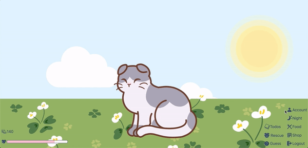
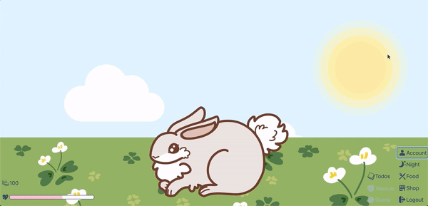

# Happiness Level

- Table of Contents
  - [Automated Testing](#automated-testing)
  - [Unit Testing](#unit-testing)
  - [Integrated Testing](#integrated-testing)

## Automated Testing

- Backend (with Postman)

  <table>
  <thead>
  <tr>
  <th></th>
  <th>
  Test Case
  </th>
  <th>
  Request Body
  </th>
  <th>
  Expected Result
  </th>
  <th>
  Actual Result
  </th>
  <th>
  Remarks
  </th>
  </tr>
  </thead>

  <tr>
  <td>
  1
  </td>
  <td>
  PUT - http://localhost:5000/api/users/userdata
  </td>
  <td>

  ```json
  {
    "name": "name",
    "happinessGained": 23,
    "totalHappinessGained": 635
  }
  ```

  </td>
  <td>

  ```json
  {
    "date": "2020-07-25T04:19:44.112Z",
    "coins": 0,
    "petId": 0,
    "totalHappinessGained": 635,
    "happinessGained": 23,
    "tasks": 0,
    "subTasks": 0,
    "dateGuessed": "2020-06-24T05:34:37.850Z",
    "dateRescued": "2020-07-25T00:00:00.000Z",
    "bestTimeRescued": 7,
    "_id": "5f1bb371725fcc3948867bc0",
    "name": "name",
    "password": "$2a$10$hvT9gftR5cDWa0rXf/p/7OQp6kV89Ywaz5JXXdtLvOonTdE/TyCM2",
    "__v": 0
  }
  ```

  </td>
  <td>
  <i>same</i> as Expected Result
  </td>
  <td></td>
  </tr>

  <tr>
  <td>
  2
  </td>
  <td>
  PUT - http://localhost:5000/api/users/userdata
  </td>
  <td>

  ```json
  {
    "name": ""
  }
  ```

  </td>
  <td>

  ```json
  {
    "name": "Name is required"
  }
  ```

  </td>
  <td>
  <i>same</i> as Expected Result
  </td>
  <td></td>
  </tr>

  <tr>
  <td>
  3
  </td>
  <td>
  PUT - http://localhost:5000/api/users/userdata
  </td>
  <td>

  ```json
  {
    "name": "name",
    "happinessGained": -5,
    "totalHappinessGained": -42
  }
  ```

  </td>
  <td>

  ```json
  {
    "happinessGained": "Happiness gained is invalid",
    "totalHappinessGained": "Total Happpiness gained is invalid"
  }
  ```

  </td>
  <td>
  <i>same</i> as Expected Result
  </td>
  <td></td>
  </tr>

  <tr>
  <td>
  4
  </td>
  <td>
  PUT - http://localhost:5000/api/users/userdata
  </td>
  <td>

  ```json
  {
    "name": "nameibbikj",
    "happinessGained": 5,
    "totalHappinessGained": 42
  }
  ```

  </td>
  <td>

  ```json
  {
    "message": "Cannot update data of user with username nameibbikj. Maybe User was not found!"
  }
  ```

  </td>
  <td>
  <i>same</i> as Expected Result
  </td>
  <td></td>
  </tr>
  
  <tr>
  <td>
  5
  </td>
  <td>
  PUT - http://localhost:5000/api/petinfos/pet
  </td>
  <td>

  ```json
  {
    "name": "name",
    "pet": {
      "pet": "Rabbit",
      "happiness": 5,
      "unlocked": true
    }
  }
  ```

  </td>
  <td>

  ```json
  {
    "happiness": 5,
    "unlocked": true,
    "_id": "5f1d780b0553ad1a9b8cf3bc",
    "pet": "Rabbit"
  }
  ```

  </td>
  <td>
  <i>same</i> as Expected Result
  </td>
  <td></td>
  </tr>
  
  <tr>
  <td>
   6
  </td>
  <td>
  PUT - http://localhost:5000/api/petinfos/pet
  </td>
  <td>

  ```json
  {
    "name": ""
  }
  ```

  </td>
  <td>

  ```json
  {
    "name": "Name is required",
    "pet": "Pet is required"
  }
  ```

  </td>
  <td>
  <i>same</i> as Expected Result
  </td>
  <td></td>
  </tr>
  
  <tr>
  <td>
  7
  </td>
  <td>
  PUT - http://localhost:5000/api/petinfos/pet
  </td>
  <td>

  ```json
  {
  "name": "name",
  "pet":
    {
      "pet": "Rabbit",
      "happiness": -31,
      "unlocked": "true"
    }
  }
  ```

  </td>
  <td>

  ```json
  {
    "pet": {
        "happiness": "Happiness for pet is invalid"
    }
  }
  ```

  </td>
  <td>
  <i>same</i> as Expected Result
  </td>
  <td></td>
  </tr>

  <tr>
  <td>
  8
  </td>
  <td>
  PUT - http://localhost:5000/api/petinfos/pet
  </td>
  <td>

  ```json
  {
  "name": "nameegkq",
  "pet":
    {
      "pet": "Rabbit",
      "happiness": 31,
      "unlocked": "true"
    }
  }
  ```

  </td>
  <td>

  ```json
  {
    "message": "Cannot update pet of user with username nameegkq. Maybe petInfo was not found!"
  }
  ```

  </td>
  <td>
  <i>same</i> as Expected Result
  </td>
  <td></td>
  </tr>
  
  </table>

## Unit Testing

(with dummy incrementHappiness and decrementHappiness buttons that increase and decrease happiness by 10 respectively)

<table>
<thead>
<tr>
<th></th>
<th>
Test Case
</th>
<th>
Expected Result
</th>
<th>
Actual Result
</th>
<th>
Remarks
</th>
</tr>
</thead>

<tr>
<td>
1
</td>
<td>
click incrementHappiness button once
</td>
<td>
happiness level increases by 10, total happiness gained increases by 10
</td>
<td>
<i>same</i> as Expected Result
</td>
<td>
Actual Result(before fix): ECONNREFUSED error, <code>this.props.auth.user.name</code> is undefined in <code>componentDidMount</code> lifecycle method in child component and <code>req.body</code> is undefined when calling PUT http://localhost:5000/api/users/userdata
Fix: Error is due to rendering of children components before parent components, retrieve userdata directly after login instead of in <code>componentDidMount</code> when child component is rendered
</td>
</tr>

<tr>
<td>
2
</td>
<td>
click decrementHappiness button once

</td>
<td>
happiness level decreases by 10
</td>
<td>
<i>same</i> as Expected Result
</td>
<td></td>
</tr>

<tr>
<td>
3
</td>
<td>
click decrementHappiness button repeatedly until happiness decreases to 0
</td>
<td>
happiness level decreases to 0, coins decrease to 0, pet transits into broken hearted state
</td>
<td>
<i>same</i> as Expected Result
</td>
<td></td>
</tr>

<tr>
<td>
4
</td>
<td>
click incrementHappiness button repeatedly as happiness increases to 100
</td>
<td>
happiness level increases to 100, total happiness gained increases, coins increase by 100, pet transits into maximum happiness state
</td>
<td>
<i>same</i> as Expected Result
</td>
<td>
Actual Result(before fix): coins increase by 100 repeatedly after happiness level reaches 100
Fix: Compare <code>prevProps</code> and <code>this.props</code>, only increase coins when happiness gained is more than 100
</td>
</tr>
</table>

## Integrated Testing

|   | Test Case                                        | Expected Result                                                                                                                                                                                                                                     | Actual Result           | Remarks                                                                                                        |
|---|--------------------------------------------------|-----------------------------------------------------------------------------------------------------------------------------------------------------------------------------------------------------------------------------------------------------|-------------------------|----------------------------------------------------------------------------------------------------------------|
| 1 | Refresh the page after a change in happiness     | Happiness level remains the same<br>                                                                                                                                            | same as Expected Result | Actual Result(before fix): previous changes are lost <br>Fix: Add redux-persist to persist auth of redux state |
| 2 | Feed pet until happiness gained increases to 100 | Happiness gained increases to at least 100, total happiness gained increases, coins increase by 100 and pet transits into maximum happiness state if happiness level is 100<br> | same as Expected Result |    
| 3 | pet's happiness reaches 0                         | Pet's state becomes brokenhearted<br> | _same_ as expected |         |
| 4 | pet's happiness exceeds 0, but is lower than 34   | Pet's state becomes sad<br>           | _same_ as expected |         |
| 5 | pet's happiness exceeds 34, but is lower than 67  | Pet's state becomes normal<br>        | _same_ as expected |         |
| 6 | pet's happiness exceeds 67, but is lower than 100 |                                       | _same_ as expected |         |
| 7 | pet's happiness reaches 100                       | Pet's state become max happiness<br>  | _same_ as expected |         |                                                                                                        |
