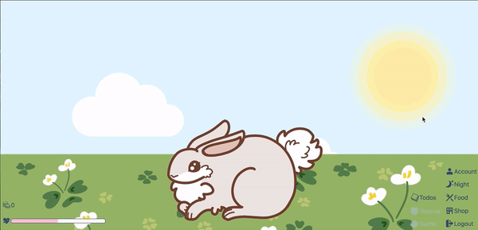
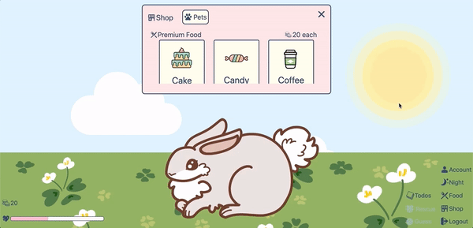
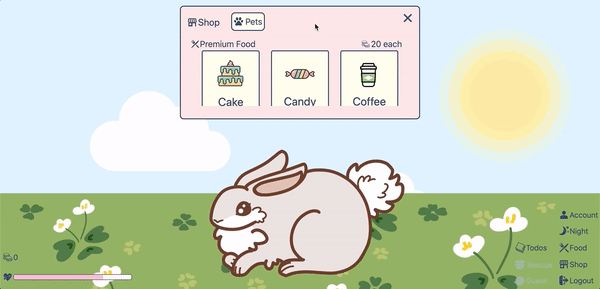
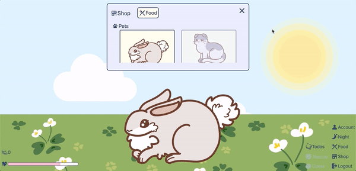
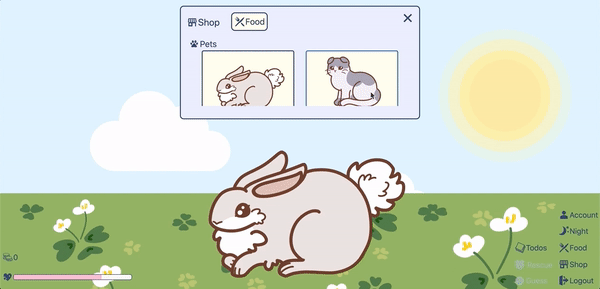
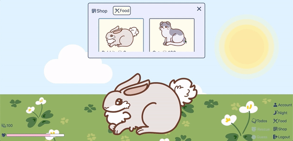

# Shop

- Table of Contents
  - [Automated Testing](#automated-testing)
  - [Unit Testing](#unit-testing)
  - [Integrated Testing](#integrated-testing)
  - [User Testing](#user-testing)

## Automated Testing

- Backend (with Postman)

    <table>
    <thead>
    <tr>
    <th></th>
    <th>
    Test Case
    </th>
    <th>
    Request Body
    </th>
    <th>
    Expected Result
    </th>
    <th>
    Actual Result
    </th>
    <th>
    Remarks
    </th>
    </tr>
    </thead>

    <tr>
    <td>
    1
    </td>
    <td>
    PUT - http://localhost:5000/api/users/userdata
    </td>
    <td>

  ```json
  {
    "name": "name",
    "coins": 40
  }
  ```

    </td>
    <td>

  ```json
  {
    "date": "2020-07-25T04:19:44.112Z",
    "coins": 40,
    "petId": 0,
    "totalHappinessGained": 635,
    "happinessGained": 23,
    "tasks": 0,
    "subTasks": 0,
    "dateGuessed": "2020-06-24T05:34:37.850Z",
    "dateRescued": "2020-07-25T00:00:00.000Z",
    "bestTimeRescued": 7,
    "_id": "5f1bb371725fcc3948867bc0",
    "name": "name",
    "password": "$2a$10$hvT9gftR5cDWa0rXf/p/7OQp6kV89Ywaz5JXXdtLvOonTdE/TyCM2",
    "__v": 0
  }
  ```

    </td>
    <td>
    <i>same</i> as Expected Result
    </td>
    <td></td>
    </tr>

    <tr>
    <td>
    2
    </td>
    <td>
    PUT - http://localhost:5000/api/users/userdata
    </td>
    <td>

  ```json
  {
    "name": ""
  }
  ```

    </td>
    <td>

  ```json
  {
    "name": "Name is required"
  }
  ```

    </td>
    <td>
    <i>same</i> as Expected Result
    </td>
    <td></td>
    </tr>

    <tr>
    <td>
    3
    </td>
    <td>
    PUT - http://localhost:5000/api/users/userdata
    </td>
    <td>

  ```json
  {
    "name": "name",
    "coins": -23
  }
  ```

    </td>
    <td>

  ```json
  {
    "coins": "Coins is invalid"
  }
  ```

    </td>
    <td>
    <i>same</i> as Expected Result
    </td>
    <td></td>
    </tr>

    <tr>
    <td>
    4
    </td>
    <td>
    PUT - http://localhost:5000/api/users/userdata
    </td>
    <td>

  ```json
  {
    "name": "namefsrfdzf",
    "coins": 2432
  }
  ```

    </td>
    <td>

  ```json
  {
    "message": "Cannot update data of user with username namefsrfdzf. Maybe User was not found!"
  }
  ```

    </td>
    <td>
    <i>same</i> as Expected Result
    </td>
    <td></td>
    </tr>

    <tr>
    <td>
    5
    </td>
    <td>
    PUT - http://localhost:5000/api/petinfos/pet
    </td>
    <td>

  ```json
  {
    "name": "name",
    "pet": {
      "pet": "Rabbit",
      "happiness": 50,
      "unlocked": true
    }
  }
  ```

    </td>
    <td>

  ```json
  {
    "happiness": 50,
    "unlocked": true,
    "_id": "5f1d780b0553ad1a9b8cf3bc",
    "pet": "Rabbit"
  }
  ```

    </td>
    <td>
    <i>same</i> as Expected Result
    </td>
    <td></td>
    </tr>

    <tr>
    <td>
    6
    </td>
    <td>
    PUT - http://localhost:5000/api/petinfos/pet
    </td>
    <td>

  ```json
  {
    "name": "name",
    "pet": {
      "pet": "Rabbit",
      "happiness": 50
    }
  }
  ```

    </td>
    <td>

  ```json
  {
    "pet": {
        "unlocked": "Unlocked for pet is required"
    }
  }
  ```

    </td>
    <td>
    <i>same</i> as Expected Result
    </td>
    <td></td>
    </tr>

    <tr>
    <td>
    7
    </td>
    <td>
    PUT - http://localhost:5000/api/petinfos/pet
    </td>
    <td>

  ```json
  {
    "name": "namesda",
    "pet": {
      "pet": "Rabbit",
      "happiness": 50,
      "unlocked": true
    }
  }
  ```

    </td>
    <td>

  ```json
  {
    "message": "Cannot update pet of user with username namesda. Maybe petInfo was not found!"
  }
  ```

    </td>
    <td>
    <i>same</i> as Expected Result
    </td>
    <td></td>
    </tr>
    </table>

## Unit Testing

(with dummy incrementCoins and decrementCoins buttons that increase and decrease coins by 7 respectively)

<table>
<thead>
<tr>
<th></th>
<th>
Test Case
</th>
<th>
Expected Result
</th>
<th>
Actual Result
</th>
<th>
Remarks
</th>
</tr>
</thead>

<tr>
<td>
1
</td>
<td>
click incrementCoins button once
</td>
<td>
coins increases by 7
</td>
<td>
<i>same</i> as Expected Result
</td>
<td></td>
</tr>

<tr>
<td>
2
</td>
<td>
click decrementCoins button once
</td>
<td>
coins decreases by 7
</td>
<td>
<i>same</i> as Expected Result
</td>
<td></td>
</tr>
</table>

(with dummy unlockCat and lockCat buttons that unlock and lock the pet cat respectively)

<table>
<thead>
<tr>
<th></th>
<th>
Test Case
</th>
<th>
Expected Result
</th>
<th>
Actual Result
</th>
<th>
Remarks
</th>
</tr>
</thead>

<tr>
<td>
1
</td>
<td>
click unlockCat button once
</td>
<td>
cat's button in shop is no longer greyed out
</td>
<td>
<i>same</i> as Expected Result
</td>
<td></td>
</tr>

<tr>
<td>
2
</td>
<td>
click lockCat button once
</td>
<td>
cat's button in shop is greyed out
</td>
<td>
<i>same</i> as Expected Result
</td>
<td></td>
</tr>
</table>

## Integrated Testing
|    | **Test Case**                                                                            | **Expected Result**                                                                                                                                                                                        | **Actual Result**         | **Remarks** |
|----|------------------------------------------------------------------------------------------|------------------------------------------------------------------------------------------------------------------------------------------------------------------------------------------------------------|---------------------------|-------------|
| 1  | click Shop button in home                                                                | Premium Food modal is shown<br>                                                                                                                        | _same_ as Expected Result |             |
| 2  | click Shop button in home while Food modal is open                                       | Food modal closes and Premium Food modal is shown<br>                                                                                                  | _same_ as Expected Result |             |
| 3  | click exit button in Premium Food modal                                                  | Premium Food modal closes<br>                                                                                                                          | _same_ as Expected Result |             |
| 4  | click outside the Premium Food modal with Premium Food modal open                        | Premium Food modal remains open<br>                                                                                                                    | _same_ as Expected Result |             |
| 5  | scroll in Premium Food modal                                                             | Premium Food modal scrolls<br>                                                                                                                         | _same_ as Expected Result |             |
| 6  | drag premium food out of modal and drop on pet with less than 20 coins                   | Insufficient Coins Error window appears and disappears after a while<br>                                                                               | _same_ as Expected Result |             |
| 7  | drag premium food out of modal and drop on pet with at least 20 coins                    | Pet transits into eating state, coins decrease by 20, happiness increases by 25, total happiness gained increases by 25 under Devour Food category<br> | _same_ as Expected Result |             |
| 8  | drag favourite premium food out of modal and drop on pet with at least 20 coins          | Pet transits into eating state, coins decrease by 20, happiness increases by 35, total happiness gained increases by 35 under Devour Food category<br> | _same_ as Expected Result |             |
| 9  | click pet button while Premium Food modal is open                                        | Premium Food modal changes to Pet modal<br>                                                                                                            | _same_ as Expected Result |             |
| 10 | click food button while Pet modal is open                                                | Pet modal changes to Premium Food modal<br>                                                                                                         | _same_ as Expected Result |             |
| 11 | click on unlocked Rabbit button                                                          | New Pet window appears<br>                                                                                                                          | _same_ as Expected Result |             |
| 12 | click on locked Cat button with less than 100 coins                                      | Insufficient Coins Error window appears<br>                                                                                                         | _same_ as Expected Result |             |
| 13 | click on locked Cat button with at least 100 coins                                       | Cat button is no longer greyed out and coins decrease by 100<br>                                                                                    | _same_ as Expected Result |             |
| 14 | click on Rabbit button, then click on Adopt a new pet button while current pet is Rabbit | Happiness of rabbit changes to 50<br>                                                                                                               | _same_ as Expected Result |             |
| 15 | click on Rabbit button, then click on Visit old pet button while current pet is Rabbit   | Happiness of rabbit remains the same<br>                                                                                                            | _same_ as Expected Result |             |
| 16 | click on Cat button, then click on Adopt a new pet button while current pet is Rabbit    | Pet changes to Cat and happiness of cat changes to 50<br>                                                                                            | _same_ as Expected Result |             |
| 17 | click on Cat button, then click on Visit old pet button while current pet is Rabbit      | Pet changes to Cat and happiness of cat remains the same<br>                                                                                         | _same_ as Expected Result |             |

## User Testing

(_coming soon_)
